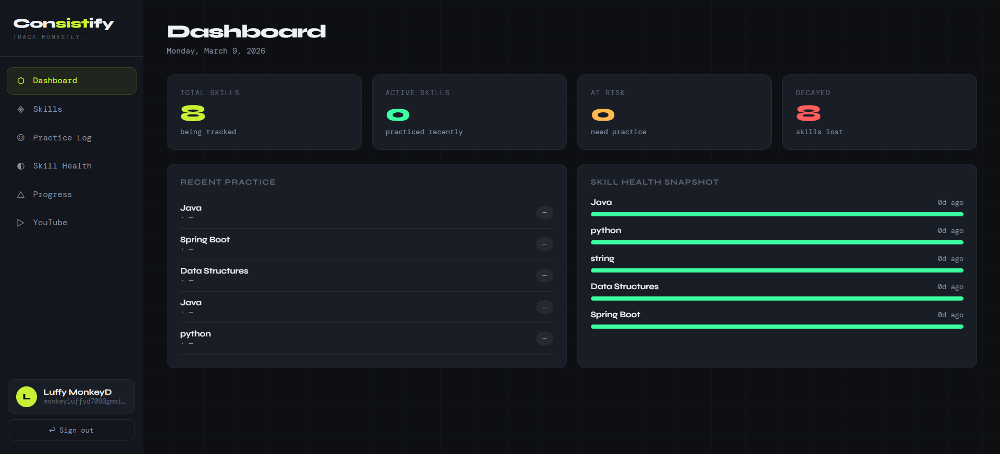
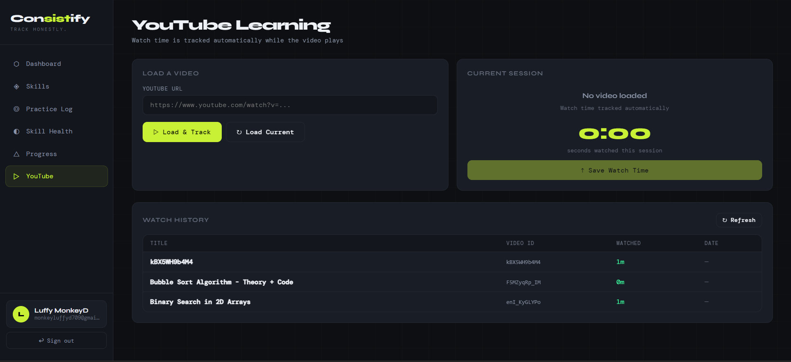
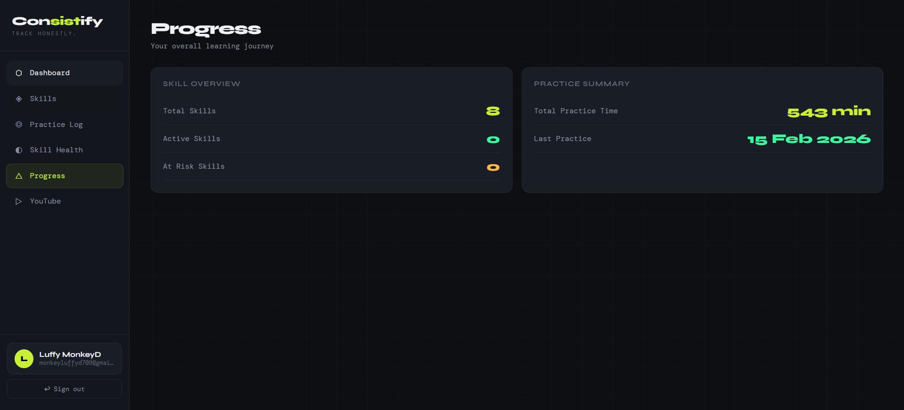
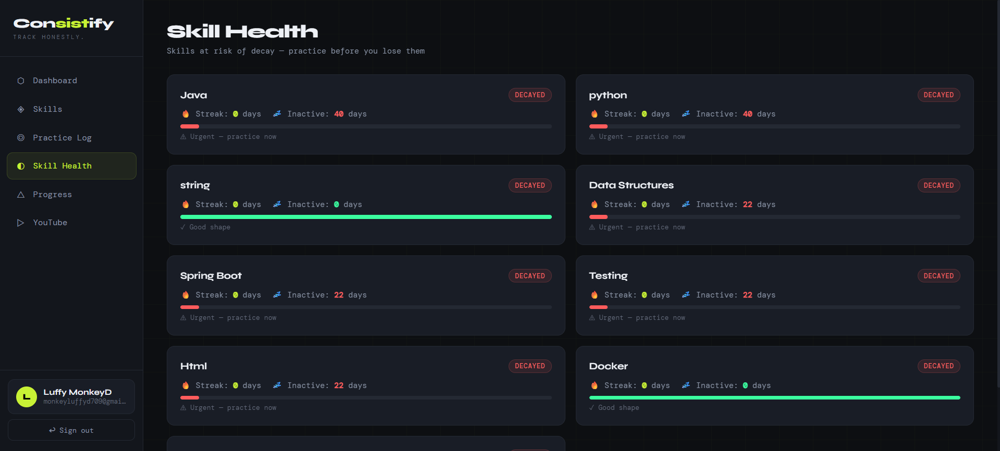
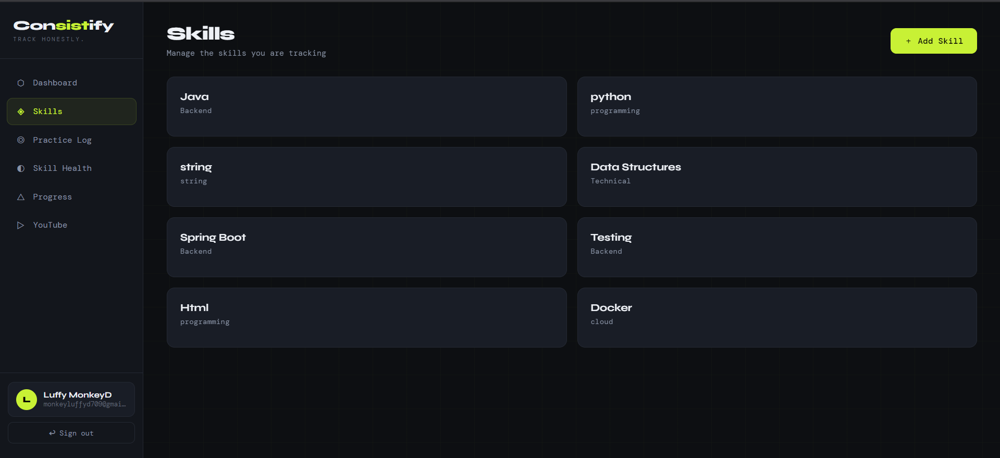

# Consistify

> **Track honestly. Learn consistently. Grow continuously.**

Consistify is a full-stack productivity tracking platform built for developers and self-learners who want **verifiable, honest accountability** over their learning. It enforces one log per skill per day, tracks skill decay automatically, and provides a distraction-free YouTube learning environment — all in one place.

🔗 **Live Demo:** [https://consistify-p9jj.onrender.com](https://consistify-p9jj.onrender.com)

---

## Screenshots
[README.md](README.md)





---

## Features

### 🔐 Authentication
- **Google OAuth2** — one-click sign-in, account auto-created on first login
- **Email + Password** — traditional sign-up/sign-in with BCrypt hashing
- Session-based authentication (no JWT), secure cookies for cross-origin deployment

### 📊 Dashboard
- Live stat cards: Total Skills, Active, At Risk, Decayed
- **Donut chart** — visual skill status breakdown
- **Bar chart** — last 7 practice sessions by duration, color-coded by effort
- **Streak leaderboard** — top skills ranked by consecutive streak days
- Recent practice feed

### 🧠 Skill Management
- Create skills with a name, category, and decay threshold (in days)
- Each skill is automatically classified as **ACTIVE**, **AT_RISK**, or **DECAYED**
- Duplicate skill names blocked per user

### 📝 Practice Logging
- Log daily practice: skill, date, effort level (HIGH / MEDIUM / LOW), duration, notes
- **One log per skill per day** — enforced at both database and service layer
- Built-in **practice timer** — stop it to auto-fill the duration field
- Immutable history — no editing or deleting past entries

### 💪 Skill Health & Streaks
- View streak, days inactive, and health status for every skill
- Health bar shows urgency — green (good), amber (warning), red (critical)
- Practice reminders built into the health view

### 📈 Progress Tracking
- Total practice time, consistency score, last practice date
- Skill overview and practice summary in one view

### 🎬 YouTube Learning
- Paste any YouTube URL — video embeds inside the platform
- **Automatic watch time tracking** while video plays
- No sidebar, no recommendations, no distractions
- Per-user watch history with total time per video

---

## Tech Stack

| Layer | Technology | Purpose |
|-------|-----------|---------|
| Backend | Java 21 + Spring Boot 3.3 | REST API, business logic, session management |
| Database | PostgreSQL 15 | Persistent storage |
| ORM | Spring Data JPA + Hibernate | Entity management, repository pattern |
| Mapper | MapStruct | Compile-time DTO ↔ Entity mapping |
| Security | Spring Security 6 | OAuth2, form login, BCrypt, session auth |
| Build | Maven 3.9 | Dependency management, packaging |
| Frontend | HTML + CSS + Vanilla JS | Single-file SPA served as static resource |
| Charts | Chart.js 4.4 | Dashboard visualizations |
| API | REST + GraphQL | REST for CRUD, GraphQL for queries |
| Deployment | Render (PaaS) | Cloud hosting + managed PostgreSQL |
| Container | Docker (multi-stage) | Maven build → JRE runtime |

---

## Project Structure

```
Consistify/
├── src/
│   ├── main/
│   │   ├── java/com.example.Consistify/
│   │   │   ├── Config/            # Security, app configuration
│   │   │   ├── Controller/        # REST + GraphQL controllers
│   │   │   ├── DTO/               # Request/Response DTOs
│   │   │   ├── Entity/            # JPA entities (User, Skill, PracticeSession...)
│   │   │   ├── ExceptionHandler/  # Global exception handling
│   │   │   ├── GraphQL/           # GraphQL resolvers and schemas
│   │   │   ├── Mapper/            # MapStruct mappers
│   │   │   ├── Repo/              # Spring Data repositories
│   │   │   ├── Service/           # Business logic
│   │   │   └── util/              # SecurityUtil, helpers
│   │   └── resources/
│   │       ├── static/            # index.html + login.html (frontend)
│   │       ├── graphql/           # schema.graphqls
│   │       ├── application.properties
│   │       └── application-prod.properties
│   └── test/
├── Dockerfile
├── pom.xml
└── README.md
```

---

## API Reference

### Authentication
| Method | Endpoint | Description |
|--------|----------|-------------|
| GET | `/api/auth/me` | Get current user name and email |
| POST | `/api/auth/register` | Register with email + password |
| POST | `/api/auth/login` | Login with email + password |
| POST | `/logout` | Invalidate session |
| GET | `/oauth2/authorization/google` | Redirect to Google OAuth |

### Skills
| Method | Endpoint | Description |
|--------|----------|-------------|
| GET | `/api/v1/skills?page=&size=` | Paginated skill list |
| POST | `/api/v1/skills` | Create skill `{ name, category, decayDays }` |
| GET | `/api/v1/skills/health` | Skill health with streak + status |

### Practice
| Method | Endpoint | Description |
|--------|----------|-------------|
| POST | `/api/v1/practice/log` | Log session `{ skillId, practiceDate, effortLevel, durationMinutes, notes }` |
| GET | `/api/v1/practice/my?page=&size=` | Paginated practice history |

### Dashboard & Progress
| Method | Endpoint | Description |
|--------|----------|-------------|
| GET | `/api/v1/dashboard` | Skill counts + total practice minutes |
| GET | `/api/v1/progress/me` | Full progress summary |

### YouTube
| Method | Endpoint | Description |
|--------|----------|-------------|
| POST | `/api/youtube/video` | Save a YouTube URL |
| GET | `/api/youtube/current` | Get most recent saved video |
| POST | `/api/youtube/watch-time` | Save watch time `{ videoId, title, watchedSeconds }` |
| GET | `/api/youtube/history` | Per-user watch history |

---

## Getting Started (Local)

### Prerequisites
- Java 21+
- Maven 3.6+
- PostgreSQL 14+ running locally
- Google OAuth2 credentials (client ID + secret) from [Google Cloud Console](https://console.cloud.google.com)

### Setup

1. **Clone the repository**
```bash
git clone https://github.com/Mohan171820/Consistify.git
cd Consistify
```

2. **Create a local PostgreSQL database**
```sql
CREATE DATABASE consistify;
```

3. **Configure `application.properties`**
```properties
spring.datasource.url=jdbc:postgresql://localhost:5432/consistify
spring.datasource.username=your_pg_user
spring.datasource.password=your_pg_password
spring.security.oauth2.client.registration.google.client-id=YOUR_GOOGLE_CLIENT_ID
spring.security.oauth2.client.registration.google.client-secret=YOUR_GOOGLE_CLIENT_SECRET
```

4. **Build and run**
```bash
mvn clean install
mvn spring-boot:run
```

5. **Open in browser**
```
http://localhost:8080/login.html
```

> ⚠️ After any entity or DTO change, always run `mvn clean install` to regenerate MapStruct mapper code.

---

## Deployment (Render)

### Environment Variables
Set these in Render → Web Service → Environment:

| Key | Value |
|-----|-------|
| `SPRING_DATASOURCE_URL` | Internal DB URL from Render PostgreSQL |
| `SPRING_DATASOURCE_USERNAME` | DB username |
| `SPRING_DATASOURCE_PASSWORD` | DB password |
| `GOOGLE_CLIENT_ID` | Google OAuth client ID |
| `GOOGLE_CLIENT_PASSWORD` | Google OAuth client secret |
| `APP_FRONTEND_URL` | `https://your-app.onrender.com` |
| `PORT` | `10000` |

### Google OAuth Redirect URIs
In Google Cloud Console → Credentials → your OAuth client:
- **Authorized origins:** `https://your-app.onrender.com`
- **Authorized redirect URI:** `https://your-app.onrender.com/login/oauth2/code/google`

### Deploy
Push to GitHub — Render auto-deploys on every push to `master`.

```bash
git add .
git commit -m "your changes"
git push origin master
```

---

## Philosophy

Consistify is built on the belief that **honest self-tracking beats inflated metrics**.

- **One log per day** — prevents retroactive gaming of your history
- **Immutable records** — what you logged is what happened, no edits
- **Skill decay** — regular practice is non-negotiable; the app reminds you
- **Distraction-free learning** — embedded YouTube removes temptation
- **Streaks that earn trust** — consecutive days of real practice, not shortcuts

---

## Roadmap

- [ ] AI-powered skill recommendations (Spring AI)
- [ ] Email notifications for decaying skills
- [ ] Mobile-responsive layout
- [ ] Export practice history as CSV
- [ ] Social leaderboard / comparison mode
- [ ] Dark / light theme toggle

---

## Author

**M. Mohan Murali**

---

## Acknowledgments

Built to solve a real problem — staying consistent and honest about learning progress. No fluff, no fake metrics, just honest tracking.

---

*Consistify — Track honestly. Learn consistently. Grow continuously.*